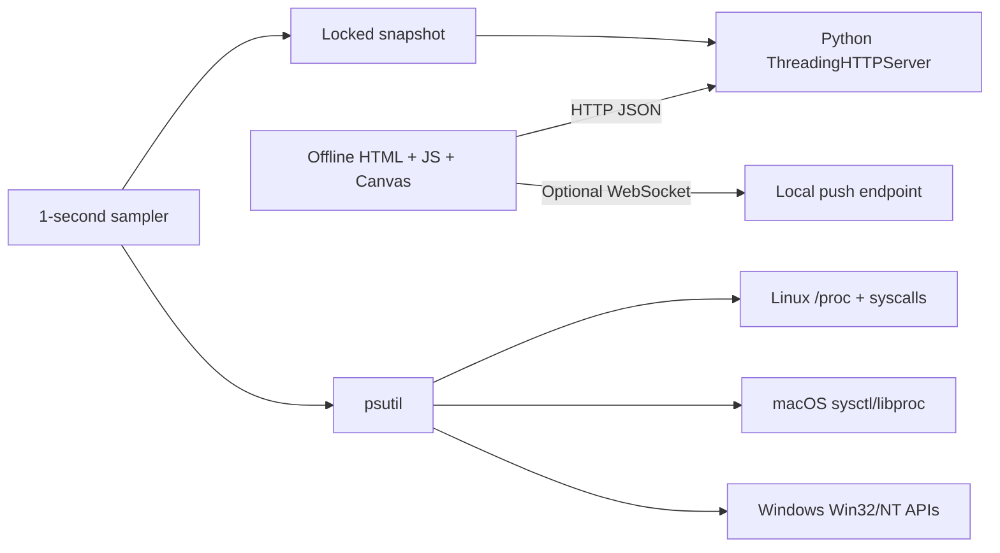

# SysWatch

Cross-platform local system monitor and process manager for Linux, macOS, and Windows 10/11. It is a mini htop / Activity Monitor / Task Manager delivered as a single offline vanilla-JS web UI.

## Requirements
- Python 3.9+
- psutil 5.9+
- Optional websockets package for the push endpoint; polling remains available.

## Run
### Linux / macOS
```bash
chmod +x run.sh
./run.sh
# or ./run.sh 9000
```

### Windows
```bat
run.bat
run.bat 9000
```

Open `http://127.0.0.1:8080`. The server binds to localhost only. Use administrator/root privileges when inspecting or controlling protected processes.

## Architecture


The background sampler owns normal telemetry collection. HTTP handlers read the latest snapshot, reducing sampling jitter from multiple browser requests.

## Features
- CPU total and per-core usage, frequency, load, uptime, OS and architecture
- RAM and swap usage
- Process list with PID, PPID, CPU, RSS, user, state, priority, threads and command line
- Process detail endpoint with open files, threads, memory maps, connections and environment where permitted
- Terminate, force-kill, stop/continue and priority controls with localhost protection
- Network interface throughput and connection listing
- Disk partitions and I/O deltas
- CPU/memory/disk threshold alerts and history
- JSON/CSV export
- SysWatch's own CPU/RSS overhead
- Dark/light responsive UI with Overview, Processes, Tree, Memory, Network, Disks, Alerts and About pages

## API
- `GET /api/stats`
- `GET /api/proc/<pid>`
- `GET /api/connections`
- `POST /api/kill?pid=N&sig=15|9|19|18`
- `POST /api/renice?pid=N&nice=-20..19`
- `GET/POST /api/alerts`
- `GET /api/export?format=json|csv`

## Cross-platform behavior
Windows uses priority classes rather than Unix nice values and may deny protected processes. macOS and Linux can similarly restrict details for other users. The UI keeps the available row and reports permission errors rather than inventing data.

## Tests
```bash
python -m unittest discover -s tests -v
```
The test suite launches real child processes, verifies schema and CPU observation, exercises process control, checks CSV export, and verifies unknown routes. It does not shell out to ps/top/tasklist.

## No mock telemetry
Displayed system numbers come from psutil and the host operating system; no random or hard-coded telemetry is used.
