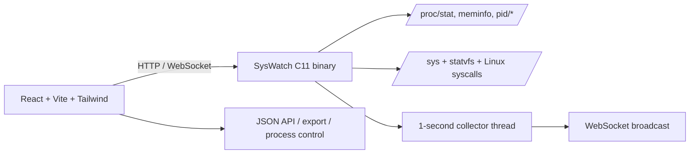

# SysWatch

SysWatch is a Linux system monitor and process manager: a browser dashboard backed by a small C11 server. It deliberately reads Linux kernel interfaces directly instead of shelling out to ps, top, or using psutil.

## Requirements

- Ubuntu 22.04+ or WSL2 with a Linux distribution
- GCC / make
- Node.js 18+ and npm
- A browser

## Run

```bash
chmod +x run.sh
./run.sh
```

Open http://127.0.0.1:8080.

### Build separately

```bash
make -C backend
cd frontend
npm install
npm run build
```

The backend serves `frontend/dist` and listens only on localhost.

## Architecture



## Kernel data sources

| Feature | Source |
|---|---|
| CPU / load / uptime / model | `/proc/stat`, `/proc/loadavg`, `/proc/uptime`, `/proc/cpuinfo` |
| Memory | `/proc/meminfo` |
| Processes | `/proc/[pid]/stat`, `status`, `cmdline`, `/proc/[pid]/fd`, `maps`, `task`, `environ` |
| Network | `/proc/net/tcp`, `/proc/net/udp`, `/proc/net/dev` |
| Disk | `/proc/diskstats`, `/proc/mounts`, `statvfs()` |
| Control | `kill()`, `setpriority()` |

## API

- `GET /api/stats` — current system/process snapshot
- `GET /api/process/:pid` — process details, descriptors, maps, threads, environment, command line
- `POST /api/process/:pid` — `action=kill|force_kill|stop|continue|renice`; SIGKILL requires `confirm=true`
- `GET /api/alerts` — thresholds and alert history
- `POST /api/alerts` — `cpu=90&memory=90&disk=90`
- `GET /api/export?format=json`
- `GET /api/export?format=csv`
- `GET /ws` — RFC6455 WebSocket stream

## Verification

The test script starts a CPU burner, checks that SysWatch reports it, and compares process/memory observations with standard Linux tools.

```bash
./tests/test_syswatch.sh
```

The test accepts `PORT=...` for isolated environments.

## Valgrind

```bash
make -C backend valgrind
```

## Screenshots

- `docs/screenshots/overview.png` — placeholder
- `docs/screenshots/processes.png` — placeholder
- `docs/screenshots/process-detail.png` — placeholder
